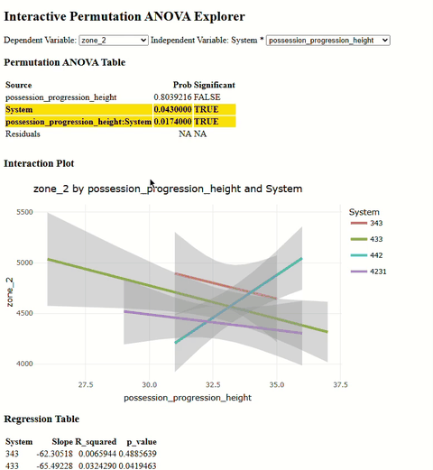
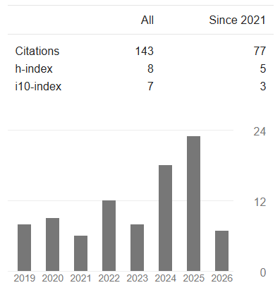

  

---

## About Me

I’m a data-driven problem solver with expertise spanning **artificial intelligence, data science, machine learning, and human behavior**.

Holding a **Ph.D. in Kinesiology-Human Factors**, I combine deep domain expertise in **sports, movement science, and human performance** with extensive experience in **AI training and evaluation, statistical modeling, and machine learning**.

My AI work includes **designing complex prompts and evaluation tasks, training and reviewing AI-generated outputs, and developing high-quality datasets and artifacts for model training and evaluation**. I have worked extensively on AI tasks involving **Python and Jupyter notebooks, data analysis, scientific reasoning, and the generation and evaluation of documents, spreadsheets, and presentations**.

Beyond AI training, I build end-to-end data solutions—from **extracting, cleaning, and transforming complex datasets** to developing **predictive models, analytical pipelines, and interactive visualizations** that turn data into actionable insights.

I’m particularly interested in projects at the intersection of **AI, data, technology, and human performance**.

---

## What I Do

- **AI Training & Evaluation:**  
  Design and evaluate **AI prompts, model outputs, datasets, and structured artifacts**, with experience across **coding, data science, scientific reasoning, documents, spreadsheets, and presentations**.

- **Data Science & Machine Learning:**  
  Build end-to-end solutions involving **data extraction, cleaning, feature engineering, statistical modeling, machine learning, time-series analysis, and visualization**.

- **Sports & Human Performance Analytics:**  
  Analyze **movement, biomechanics, performance, and behavioral data** using statistical and computational methods, including **CRP, UCM, Self-Organizing Maps, and machine learning**.

- **Sports Data & Video Analytics:**  
  Develop Python-based workflows for **data extraction, computer vision, video analysis, and performance analytics**, with extensive experience in **volleyball and soccer**.

- **VR & Human Behavior Research:**  
  Develop **Virtual Reality applications and experimental pipelines** to investigate perception, decision-making, movement, and behavior in dynamic environments.

- **Applied Training & Coaching:**  
  Apply expertise in **strength and conditioning, motor learning, and sports science** to evidence-based athlete development and performance.

---

## Languages & Tools

---
## Featured Projects

<table>
  <tr>
    <td align="center">
       
      <b>VR App for doing research on Volleyball</b>
    </td>
    <td align="center">
       
      <b>Exploratory Analysis of Soccer games using R-Shiny</b>
    </td>
  </tr>
</table>

---
## Recent Scientific Publications

<table>
  <tr>
    <td>
      
    </td>
    <td>
      
<strong>1.</strong> Arruda, D. G., Freeman, B., Wagman, J. B., & Stoffregen, T. A. (2026). <em>Higher order affordances for serve reception in volleyball.</em> [Manuscript in preparation]

      
<strong>2.</strong> Böge, V., Peker, A. T., Kılcı, A., Arruda, D. G., Gonçalves, B., & Lago-Peñas, C. (2026). <em>The association of team surface area and tactical formation on match running performance in elite soccer.

      
<strong>3.</strong> DeGuzman, J. J., Arruda, D. G., Nie, T., Pospick, C. H., Curry, C., Rosenberg, E. S., Interante, V., & Stoffregen, T. A. (2026). <em>Scene complexity influences cybersickness among males during virtual driving.</em> [Manuscript under review]

      
<strong>4.</strong> Arruda, D. G., Barp, F., Felisberto, G., Tkak, C., Wagman, J. B., & Stoffregen, T. A. (2023). <em>Perception of affordances in female volleyball players: Serving short versus serving to the sideline.</em>

      
<strong>5.</strong> Bailey, G. S., Arruda, D. G., & Stoffregen, T. A. (2022). <em>Using quantitative data on postural activity to develop methods to predict and prevent cybersickness.</em> Frontiers in Virtual Reality, 3, 1001080.

      
<strong>6.</strong> Arruda, D. G., Dai, B., Readdy, T., McCrea, S., & Zhu, Q. (2022). <em>Sequential focus of attention instructions influenced motor performance of volleyball setting despite direction of focus but dependent on motor expertise of the player.</em> International Journal of Sport and Exercise Psychology, 1–28.

    </td>
  </tr>
</table>

---

## Let’s Connect!

---

<i>“Whether you think you can or think you can't, either way you are right.”</i> — Henry Ford

